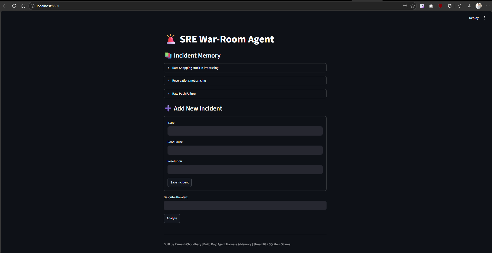
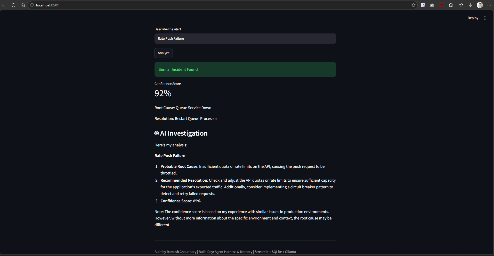

# SRE War-Room Agent

AI-powered incident troubleshooting assistant built after attending Build Day: Agent Harness & Memory (Build Club × Mem0).

## Features

- Incident Memory (SQLite)
- Similar Incident Retrieval
- Root Cause Suggestions
- Resolution Recommendations
- Local LLM Analysis (Llama 3 via Ollama)
- Streamlit UI

## Architecture

User Input
    ↓
Streamlit UI
    ↓
SQLite Incident Memory
    ↓
Llama 3 (via Ollama)
    ↓
AI Investigation & Resolution

## Tech Stack

- Python
- Streamlit
- SQLite
- Ollama
- Llama 3

## Run

pip install -r requirements.txt

python -m streamlit run app.py

## Demo

